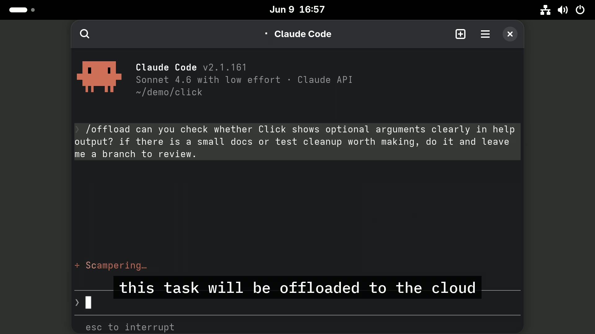

# /offload

`/offload` lets coding agents continue long-running tasks on another machine.

You may, for example:

```text
/offload look through leads.csv, email the 500 best matches about our invoice
cleanup service between 9am and 5pm, track who replies and what they ask,
and stop Wednesday with a short review summary and recommended next steps
```

The agent sends your current project state to another machine, runs the task
there, and keeps any changes on a new branch.

The run can continue even if your laptop sleeps or disconnects. It can send
status updates, expose remote `localhost:<port>` dev servers through
authenticated public URLs, and use the official Claude Code or Codex remote
controls to check in or steer it.

## Demo Video

[](https://github.com/ToxicPine/offloads/raw/refs/heads/master/media/offload-demo-25s-v2-youtube-1080p30.mp4)

That machine can be any computer you can reach, or `/offload` can deploy a
cloud one for you on [Fly](https://fly.io), much like Cursor Cloud Agents.

## Install

`/offload` is an agent skill; no persistent local software is needed.

Install from GitHub:

```sh
curl -fsSL https://raw.githubusercontent.com/ToxicPine/offloads/master/install-offload | bash
```

Pass options after `bash -s --`, for example `--yes` to skip the prompt or
`--silent` for quiet installs.

## (Technical) How It Works

`/offload` ships with a zero-install, rootless way to run the Nix package
manager, and the skill helps manage the work of making your project runnable as
a Nix flake. That lets the repo define the project environment the remote
machine needs in order to work with it correctly.

The next part is the remote target: a container designed for work, with the
right tooling installed, runtime Nix builds, persistent state, and a way to
expose dev servers running on its own `localhost:<port>` through authenticated
public URLs. The skill includes instructions for deploying that container on Fly.

The rest is integration polish, like checking and seeding GitHub credentials,
git identity, repo state, and coding-agent login state for tools like Codex and
Claude Code. The goal is simple: run the same project somewhere else and return
the result as a normal branch.

### Optional: Hermes Agent Integration With Telegram

The machine includes [Hermes](https://hermes-agent.nousresearch.com/) by
default. You can optionally enable its Telegram integration for progress pings,
phone supervision, and quick interventions like asking the remote agent for a
dev-server link. `/offload` still works without it.

## Packages

`offload` is the main agent skill. It decides whether a remote computer is ready,
helps set one up when needed, and starts the offloaded run.

`offloader` sends a command from your current git project to the remote computer
and creates the run branch that receives the work.

`offloader-configurator` checks and seeds the remote computer with the account
state it needs, such as GitHub and assistant login.

`offloader-container` is the ready-to-run remote computer image used by the
default setup.

`offloader-transports` is the small set of ways to reach that computer, including
Fly.io, plain SSH, and Tailscale SSH.

`nestail` turns `localhost:<port>` on the remote computer into an openable URL,
and can generate protected share links for that port.

`vusperize` wraps long work so it can send live status updates while it runs.

`boondoggler` gives Codex a goal, lets it work from the remote branch, then
commits and pushes the result back.
